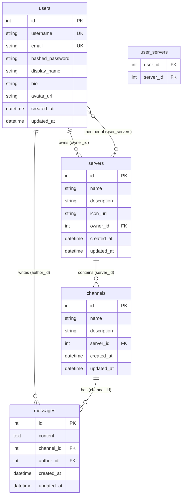
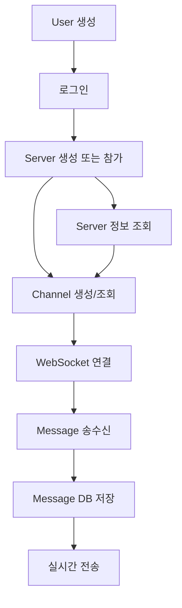
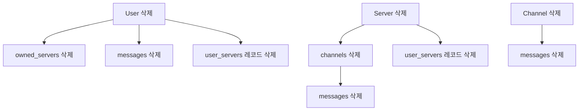

# Database Schema

## 개요

Discord 스타일 채팅 애플리케이션의 데이터베이스 구조입니다.

- **데이터베이스**: PostgreSQL
- **ORM**: SQLAlchemy
- **총 테이블 수**: 5개 (4개 주요 테이블 + 1개 연결 테이블)

---

## ERD (Entity Relationship Diagram)



---

## 테이블 상세

### 1. users (사용자)

사용자 계정 정보를 저장합니다.

| 컬럼 | 타입 | 제약조건 | 설명 |
|------|------|----------|------|
| **id** | Integer | PRIMARY KEY, AUTO INCREMENT | 사용자 고유 ID |
| **username** | String | UNIQUE, NOT NULL, INDEX | 사용자명 (로그인용) |
| **email** | String | UNIQUE, NOT NULL, INDEX | 이메일 주소 |
| **hashed_password** | String | NOT NULL | bcrypt 해시된 비밀번호 |
| **display_name** | String | NULL | 표시 이름 (닉네임) |
| **bio** | String | NULL | 자기소개 |
| **avatar_url** | String | NULL | 프로필 이미지 URL |
| **created_at** | DateTime | DEFAULT NOW | 계정 생성 시간 |
| **updated_at** | DateTime | DEFAULT NOW, ON UPDATE NOW | 마지막 수정 시간 |

**인덱스**
- `username` (UNIQUE INDEX)
- `email` (UNIQUE INDEX)

**관계**
- `servers` (Many-to-Many): 사용자가 멤버로 속한 서버들
- `owned_servers` (One-to-Many): 사용자가 소유한 서버들
- `messages` (One-to-Many): 사용자가 작성한 메시지들

---

### 2. servers (서버/메인 채팅방)

Discord의 서버와 같은 메인 채팅 공간입니다.

| 컬럼 | 타입 | 제약조건 | 설명 |
|------|------|----------|------|
| **id** | Integer | PRIMARY KEY, AUTO INCREMENT | 서버 고유 ID |
| **name** | String | NOT NULL | 서버 이름 |
| **description** | String | NULL | 서버 설명 |
| **icon_url** | String | NULL | 서버 아이콘 URL |
| **owner_id** | Integer | FOREIGN KEY (users.id), NOT NULL, ON DELETE CASCADE | 서버 소유자 ID |
| **created_at** | DateTime | DEFAULT NOW | 서버 생성 시간 |
| **updated_at** | DateTime | DEFAULT NOW, ON UPDATE NOW | 마지막 수정 시간 |

**외래키**
- `owner_id` → `users.id` (ON DELETE CASCADE)

**관계**
- `owner` (Many-to-One): 서버 소유자
- `members` (Many-to-Many): 서버 멤버들
- `channels` (One-to-Many): 서버에 속한 채널들

**Cascade 규칙**
- 소유자 삭제 시: 서버도 함께 삭제됨

---

### 3. channels (채널/서브 채팅방)

서버 내의 개별 채팅 채널입니다.

| 컬럼 | 타입 | 제약조건 | 설명 |
|------|------|----------|------|
| **id** | Integer | PRIMARY KEY, AUTO INCREMENT | 채널 고유 ID |
| **name** | String | NOT NULL | 채널 이름 |
| **description** | String | NULL | 채널 설명 |
| **server_id** | Integer | FOREIGN KEY (servers.id), NOT NULL, ON DELETE CASCADE | 소속 서버 ID |
| **created_at** | DateTime | DEFAULT NOW | 채널 생성 시간 |
| **updated_at** | DateTime | DEFAULT NOW, ON UPDATE NOW | 마지막 수정 시간 |

**외래키**
- `server_id` → `servers.id` (ON DELETE CASCADE)

**관계**
- `server` (Many-to-One): 채널이 속한 서버
- `messages` (One-to-Many): 채널의 메시지들

**Cascade 규칙**
- 서버 삭제 시: 채널도 함께 삭제됨

---

### 4. messages (메시지)

채널에서 주고받는 채팅 메시지입니다.

| 컬럼 | 타입 | 제약조건 | 설명 |
|------|------|----------|------|
| **id** | Integer | PRIMARY KEY, AUTO INCREMENT | 메시지 고유 ID |
| **content** | Text | NOT NULL | 메시지 내용 |
| **channel_id** | Integer | FOREIGN KEY (channels.id), NOT NULL, ON DELETE CASCADE | 메시지가 속한 채널 ID |
| **author_id** | Integer | FOREIGN KEY (users.id), NOT NULL, ON DELETE CASCADE | 작성자 ID |
| **created_at** | DateTime | DEFAULT NOW | 메시지 작성 시간 |
| **updated_at** | DateTime | DEFAULT NOW, ON UPDATE NOW | 마지막 수정 시간 |

**외래키**
- `channel_id` → `channels.id` (ON DELETE CASCADE)
- `author_id` → `users.id` (ON DELETE CASCADE)

**관계**
- `channel` (Many-to-One): 메시지가 속한 채널
- `author` (Many-to-One): 메시지 작성자

**Cascade 규칙**
- 채널 삭제 시: 메시지도 함께 삭제됨
- 작성자 삭제 시: 메시지도 함께 삭제됨

---

### 5. user_servers (사용자-서버 연결 테이블)

사용자와 서버 간의 다대다(Many-to-Many) 관계를 표현하는 연결 테이블입니다.

| 컬럼 | 타입 | 제약조건 | 설명 |
|------|------|----------|------|
| **user_id** | Integer | FOREIGN KEY (users.id), ON DELETE CASCADE | 사용자 ID |
| **server_id** | Integer | FOREIGN KEY (servers.id), ON DELETE CASCADE | 서버 ID |

**복합 기본키**
- (user_id, server_id)

**외래키**
- `user_id` → `users.id` (ON DELETE CASCADE)
- `server_id` → `servers.id` (ON DELETE CASCADE)

**Cascade 규칙**
- 사용자 또는 서버 삭제 시: 연결 레코드도 함께 삭제됨

---

## 데이터 흐름도



---

## 관계 설명

### 1. User ↔ Server (Many-to-Many)

**관계 유형**: 다대다
- 한 사용자는 여러 서버의 멤버가 될 수 있습니다
- 한 서버는 여러 사용자를 멤버로 가질 수 있습니다
- `user_servers` 테이블로 연결됩니다

**예시**
```python
# 사용자가 속한 서버 목록
user.servers  # List[Server]

# 서버의 멤버 목록
server.members  # List[User]
```

---

### 2. User → Server (One-to-Many, 소유권)

**관계 유형**: 일대다
- 한 사용자는 여러 서버를 소유할 수 있습니다
- 한 서버는 한 명의 소유자만 가집니다
- `servers.owner_id` 외래키로 연결됩니다

**예시**
```python
# 사용자가 소유한 서버 목록
user.owned_servers  # List[Server]

# 서버의 소유자
server.owner  # User
```

---

### 3. Server → Channel (One-to-Many)

**관계 유형**: 일대다
- 한 서버는 여러 채널을 가질 수 있습니다
- 한 채널은 한 서버에만 속합니다
- `channels.server_id` 외래키로 연결됩니다

**Cascade**: 서버 삭제 시 모든 채널 삭제

**예시**
```python
# 서버의 채널 목록
server.channels  # List[Channel]

# 채널이 속한 서버
channel.server  # Server
```

---

### 4. User → Message (One-to-Many)

**관계 유형**: 일대다
- 한 사용자는 여러 메시지를 작성할 수 있습니다
- 한 메시지는 한 명의 작성자를 가집니다
- `messages.author_id` 외래키로 연결됩니다

**Cascade**: 사용자 삭제 시 모든 메시지 삭제

**예시**
```python
# 사용자가 작성한 메시지 목록
user.messages  # List[Message]

# 메시지 작성자
message.author  # User
```

---

### 5. Channel → Message (One-to-Many)

**관계 유형**: 일대다
- 한 채널은 여러 메시지를 가질 수 있습니다
- 한 메시지는 한 채널에만 속합니다
- `messages.channel_id` 외래키로 연결됩니다

**Cascade**: 채널 삭제 시 모든 메시지 삭제

**예시**
```python
# 채널의 메시지 목록
channel.messages  # List[Message]

# 메시지가 속한 채널
message.channel  # Channel
```

---

## Cascade 삭제 정책

### 삭제 연쇄 효과



### 예시

1. **사용자 삭제 시**
   - 소유한 모든 서버 삭제
     - 그 서버의 모든 채널 삭제
       - 그 채널의 모든 메시지 삭제
   - 작성한 모든 메시지 삭제
   - 서버 멤버십 삭제

2. **서버 삭제 시**
   - 서버의 모든 채널 삭제
     - 그 채널의 모든 메시지 삭제
   - 서버 멤버십 삭제

3. **채널 삭제 시**
   - 채널의 모든 메시지 삭제

---

## 인덱스 전략

### 기본 인덱스

1. **Primary Keys**
   - 모든 테이블의 `id` 컬럼

2. **Unique Indexes**
   - `users.username`
   - `users.email`

3. **Foreign Key Indexes**
   - SQLAlchemy가 자동으로 생성
   - `servers.owner_id`
   - `channels.server_id`
   - `messages.channel_id`
   - `messages.author_id`

### 추가 권장 인덱스

성능 향상을 위해 다음 인덱스 추가를 고려할 수 있습니다:

```sql
-- 메시지 조회 최적화 (channel_id + created_at)
CREATE INDEX idx_messages_channel_created ON messages(channel_id, created_at DESC);

-- 사용자별 메시지 조회
CREATE INDEX idx_messages_author ON messages(author_id);

-- 서버별 채널 조회
CREATE INDEX idx_channels_server ON channels(server_id);
```

---

## 데이터베이스 생성 SQL

PostgreSQL에서 데이터베이스를 수동으로 생성하는 경우:

```sql
-- 데이터베이스 생성
CREATE DATABASE chatapp_db;

-- 연결
\c chatapp_db;

-- 테이블은 SQLAlchemy가 자동 생성합니다 (app/main.py의 Base.metadata.create_all)
```

---

## SQLAlchemy 모델 파일 위치

- `app/models/user.py` - User 모델 및 user_servers 테이블
- `app/models/server.py` - Server 모델
- `app/models/channel.py` - Channel 모델
- `app/models/message.py` - Message 모델

---

## 예제 쿼리

### 1. 서버의 모든 멤버 조회

```python
server = db.query(Server).filter(Server.id == server_id).first()
members = server.members  # List[User]
```

### 2. 사용자가 속한 모든 서버 조회

```python
user = db.query(User).filter(User.id == user_id).first()
servers = user.servers  # List[Server]
```

### 3. 채널의 최근 메시지 50개 조회

```python
messages = db.query(Message).filter(
    Message.channel_id == channel_id
).order_by(Message.created_at.desc()).limit(50).all()
```

### 4. 사용자가 특정 서버의 멤버인지 확인

```python
server = db.query(Server).filter(Server.id == server_id).first()
is_member = user in server.members  # Boolean
```

### 5. 서버의 모든 채널과 각 채널의 메시지 수 조회

```python
from sqlalchemy import func

result = db.query(
    Channel.id,
    Channel.name,
    func.count(Message.id).label('message_count')
).outerjoin(Message).filter(
    Channel.server_id == server_id
).group_by(Channel.id).all()
```

---

## 마이그레이션

### Alembic 사용 (권장)

```bash
# 마이그레이션 초기화
alembic init alembic

# 마이그레이션 파일 생성
alembic revision --autogenerate -m "Initial migration"

# 마이그레이션 적용
alembic upgrade head
```

### 직접 생성 (개발 환경)

```python
# app/main.py에서 자동 생성
from .database import engine, Base
Base.metadata.create_all(bind=engine)
```

---

## 데이터 무결성 규칙

1. **사용자명과 이메일은 고유해야 함**
   - UNIQUE 제약조건으로 보장

2. **서버 소유자는 서버를 나갈 수 없음**
   - 애플리케이션 레벨에서 검증 (app/routers/server.py:179)

3. **채널은 서버 소유자만 생성/수정/삭제 가능**
   - 애플리케이션 레벨에서 권한 검증

4. **서버 멤버만 채널과 메시지에 접근 가능**
   - 애플리케이션 레벨에서 권한 검증

5. **모든 외래키는 CASCADE 삭제**
   - 참조 무결성 보장

---

## 참고사항

- 모든 날짜/시간은 UTC로 저장됩니다
- `updated_at`은 레코드 수정 시 자동으로 갱신됩니다
- 비밀번호는 bcrypt로 해시되어 저장됩니다 (원본 저장 안 함)
- 모든 테이블은 `created_at`, `updated_at` 타임스탬프를 가집니다
